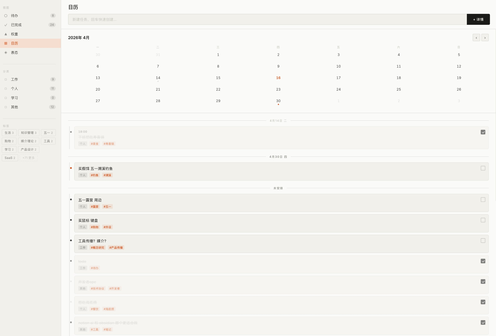
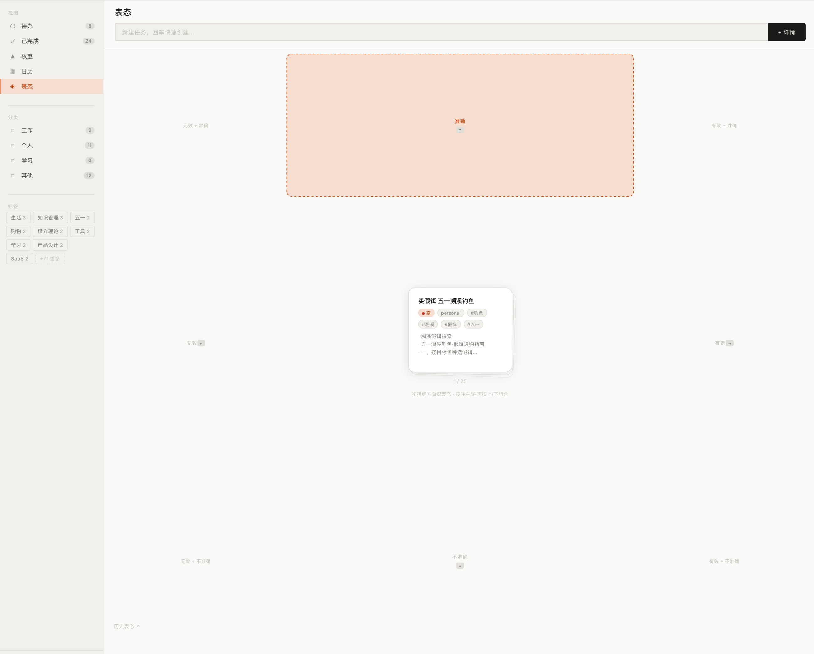
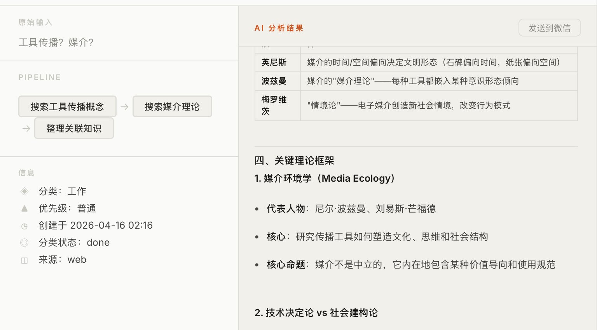
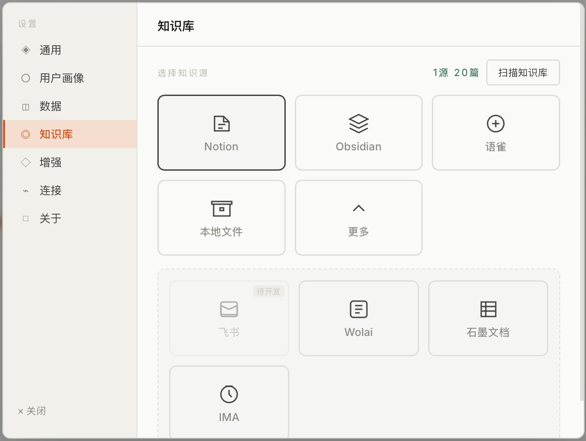
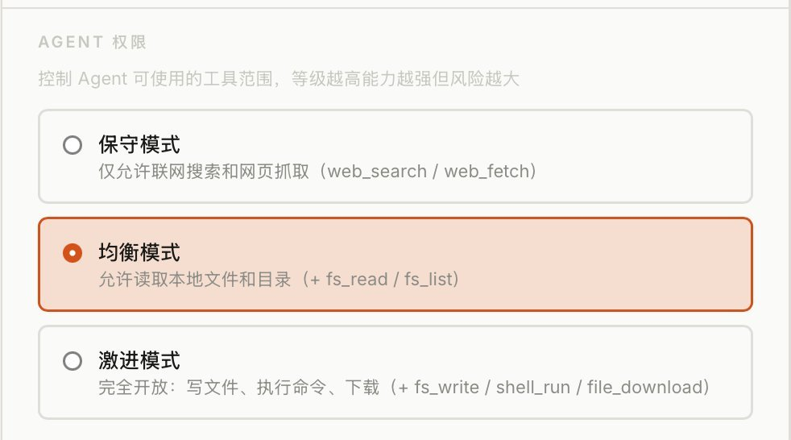
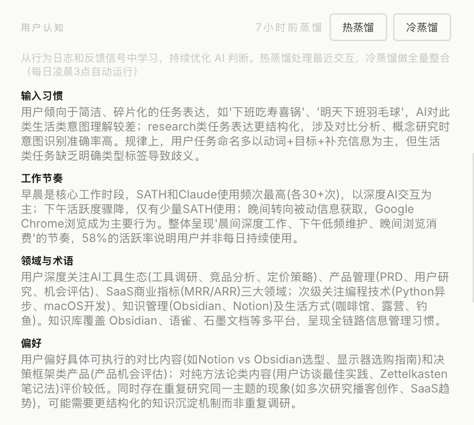
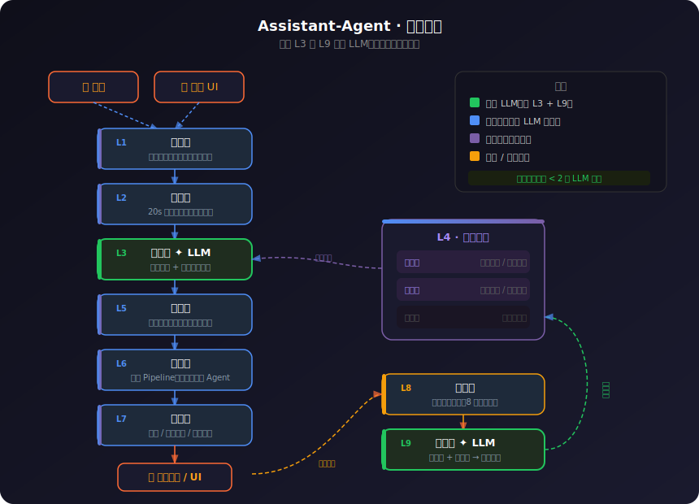
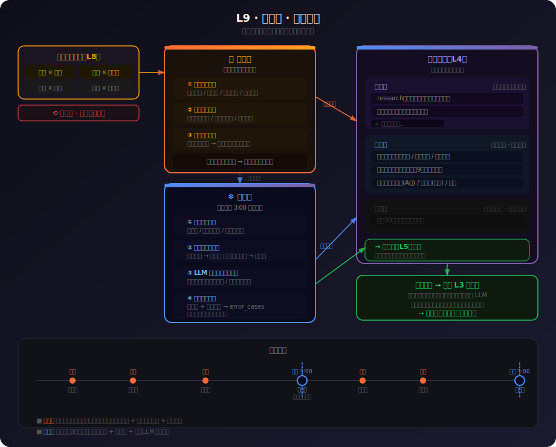
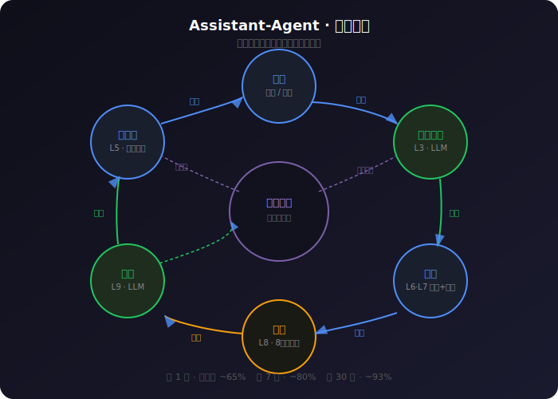

# Assistant-Agent

> 外壳是 Todo 工具，内核是完整秘书系统。  
> 九层架构，只有两层调用 LLM，其余全是规则引擎——成本可控，越用越懂你。

---

## 效果演示

> 以下基于模拟用户「张晨」30天行为推演，展示系统从冷启动到成熟期的变化。

| 指标 | 冷启动期（第1天） | 成熟期（第45天） |
|------|:---:|:---:|
| 平均置信度 | 0.73 | **0.90** |
| 直接执行比例 | 20% | **100%** |
| 推送条数 | 3条 | **6条**（更精准） |
| 用户输入字数 | 124字 | **31字**（少75%，做的更多）|

**同一条输入，两个阶段的差距：**

用户说「猫粮快没了，明天要买」——  
- 第1天：「记得买猫粮（待办）」— 品牌渠道全不知道  
- 第45天：「Royal Canin 成猫粮 4kg，京东 ¥168，已创建待办」— 直接执行

[→ 查看完整五组对比](docs/demo.html)

---

## 它解决什么问题

大多数 AI 工具解决的是"怎么执行"。Assistant-Agent 解决的是更前面那步——**搞清楚你要做什么、为什么做，然后替你执行，不打断你**。

你在微信发一条"查一下这个"，系统不会问你查什么、查多深、用什么格式返回。它从你过去的行为里知道答案，直接去做，做完推给你。

---

## 界面截图

### 任务管理

| 日历视图 | 表态矩阵 |
|:---:|:---:|
|  |  |
| 按日期/分类/标签浏览任务，支持多维过滤 | 拖拽评分（有效 × 准确），反馈直接进入蒸馏 |

### AI 执行与设置

| AI 分析 Pipeline | 知识库接入 |
|:---:|:---:|
|  |  |
| 输入「工具传播？媒介？」→ 自动拆解步骤并联网研究 | 支持 Notion / Obsidian / 语雀 / 本地文件 |

### 核心：用户画像蒸馏

| Agent 权限控制 | L9 蒸馏输出 · 用户认知 |
|:---:|:---:|
|  |  |
| 三档权限，保守 → 均衡 → 激进，按需开放 | **系统自动提炼的用户画像**：输入习惯、工作节奏、领域偏好、决策风格，每日凌晨 3 点冷蒸馏更新 |

---

## 九层架构详解




```
  微信 / 桌面 UI
       ↓
  ┌─────────────┐
  │  L1  输入层  │  聚合多渠道消息
  └──────┬──────┘
         ↓
  ┌─────────────┐
  │  L2  缓冲层  │  20 秒防抖，合并碎片意图
  └──────┬──────┘
         ↓
  ┌─────────────┐     ┌──────────────┐
  │  L3  意图层  │ ←── │  L4 用户模型  │  注入个人习惯
  └──────┬──────┘     └──────────────┘
         ↓
  ┌─────────────┐
  │  L5  技能库  │  语义匹配历史成功路径
  └──────┬──────┘
         ↓
  ┌─────────────┐
  │  L6  编排层  │  拆分 Pipeline，并行调度子 Agent
  └──────┬──────┘
         ↓
  ┌─────────────┐
  │  L7  执行层  │  搜索 / 读写文件 / 调用工具
  └──────┬──────┘
         ↓
  ┌─────────────┐
  │  L8  复盘层  │  收集用户反馈（有效 / 准确）
  └──────┬──────┘
         ↓
  ┌─────────────┐
  │  L9  蒸馏层  │  更新用户画像（热蒸馏 + 冷蒸馏）
  └─────────────┘
```

---

### L1 · 输入层

**职责**：聚合来自微信、桌面 UI 的原始消息，统一格式化后送入缓冲池。

- 支持微信 iLink Bot（当前接入）和 ClawBot webhook（灰测备用）
- 每条消息携带来源渠道、时间戳、用户 ID
- 不做任何语义处理，只负责接收和格式化

---

### L2 · 缓冲层

**职责**：20 秒滑动窗口聚合碎片意图，防止把一句话拆成多个任务处理。

- 使用 `BufferPool`（threading.Timer 驱动），窗口大小从用户节律参数读取
- 20 秒内连续输入的消息合并为一个意图单元
- 窗口到期后自动触发回调，将合并后的内容推入意图层
- 支持 `flush_now` 强制立即触发（急件场景）

**为什么需要这层**：人的表达是碎片化的。"帮我查一下" + "五一广东溯溪" + "主要看水位" 三条消息，应该是一个任务，而不是三个。

---

### L3 · 意图层 ★ 调用 LLM

**职责**：识别用户意图，注入个人习惯，输出结构化的执行指令。

- 使用 LLM（默认 GPT-4o-mini）做语义理解
- **关键**：提示词里注入了用户画像（固化模式 + 活跃偏好 + 节律参数），同一句话对不同用户产生不同深度的响应
- 输出包含：意图类型、6 维拓扑（who/what/where/when/why/how）、置信度、是否需要主动信息增益、后悔药窗口时长
- **任何置信度都执行，不询问用户**——信息缺口由用户模型自动补全
- LLM 不可用时，规则引擎兜底（置信度 0.35–0.45）

---

### L4 · 用户模型

**职责**：存储和管理用户的个人画像，供其他层读取。

数据结构分三层：

| 层级 | 内容 | 更新频率 |
|------|------|---------|
| 固化层 | 已验证的稳定偏好（如"研究类任务要给数据来源"） | 冷蒸馏后升档 |
| 活跃层 | 近期高频行为和临时偏好 | 热蒸馏实时更新 |
| 归档层 | 失效的旧偏好 | 长期未触发后降档 |

还包含：
- **节律参数**：工作高峰时段、输出风格偏好、首选渠道
- **关系网络**：提及过的人物及亲密度权重
- **场景维度**：当前主要事件群（如"五一溯溪计划"包含 9 个相关任务）

---

### L5 · 技能库

**职责**：语义匹配历史成功路径，有现成模板直接复用，避免重复拆 Pipeline。

- 存储历史高频成功执行路径（自动从行为日志提炼）
- 匹配逻辑：关键词 + 意图类型 + 场景维度三维匹配（预留 ChromaDB 向量接口）
- 命中技能 → 直接走模板，跳过 L6 编排，速度更快、成本更低
- 未命中 → 进入 L6 动态编排

---

### L6 · 编排层

**职责**：将意图拆分为子任务 Pipeline，编排多个 Agent 并行执行。

- `OrchestratorAgent` 是系统唯一对用户界面的 Agent，所有子 Agent 的输出都汇报给它，不直接触达用户
- 按权限层路由执行方式：**告知**（只展示结果）/ **建议**（等待确认）/ **执行**（自动完成）
- 主动信息增益：灵感/策略类意图自动触发后台网络搜索，结果就绪后主动推送
- 60 秒心跳：扫描即将到期的提醒、info_gain 结果就绪通知
- 25 轮保护：第 24 轮提示收尾，第 25 轮强制停止，防止 Agent 失控循环

---

### L7 · 执行层

**职责**：实际调用工具完成任务。

支持的工具集（按权限档位开放）：

| 工具 | 权限档 | 说明 |
|------|--------|------|
| `web_search` | 保守 | 联网搜索（Tavily / Brave） |
| `web_fetch` | 保守 | 网页内容抓取 |
| `fs_read` / `fs_list` | 均衡 | 读取本地文件/目录 |
| `fs_write` | 激进 | 写入本地文件 |
| `shell_run` | 激进 | 执行终端命令 |
| `file_download` | 激进 | 下载文件 |

权限档位在设置页可调，默认保守模式。

---

### L8 · 复盘层

**职责**：收集用户对执行结果的反馈，作为蒸馏的原始信号。

8 状态反馈矩阵：

```
有效 × 准确   → 强化该路径权重
有效 × 不准确 → 结果有用但方向偏，调整意图识别
无效 × 准确   → 方向对但没用上，调整执行策略
无效 × 不准确 → 记入错误案例，重新学习
+ regret（后悔药）→ 在窗口期内撤销已执行的动作
```

---

### L9 · 蒸馏层 ★ 调用 LLM

**职责**：将反馈信号蒸馏进用户画像，让系统越用越准。

两种蒸馏模式：

**热蒸馏**（每次交互后实时）
- 记录行为日志
- 更新关系网络权重
- 候选固化模式（高频成功路径）

**冷蒸馏**（每日凌晨 3 点）
- 汇总意图频率，发现新的行为规律
- 升降档固化模式（长期验证 → 固化层 / 长期未触发 → 归档层）
- 可选 LLM 深度蒸馏（生成自然语言画像摘要）

**不存历史记录，存蒸馏后的画像**——每次调用带进去的是精炼的用户理解，而不是原始对话流水账。



---

## 飞轮闭环



## 成本控制

全链路只有两个节点调用 LLM：**L3 意图识别** 和 **L9 蒸馏**。其余七层全部是规则引擎或本地计算。

平均每条任务 LLM 调用 < 2 次，使用 GPT-4o-mini 约 $0.001/条。

---

## 快速开始

### 依赖

- macOS 12+
- Python 3.10+
- OpenAI API Key（或兼容接口，如 DeepSeek / 月之暗面）

### 安装

```bash
git clone https://github.com/caiaiacai/Assistant-Agent.git
cd Assistant-Agent
pip install -r requirements.txt
python bridge.py
```

打开 `index.html` 即可使用桌面 UI。

### 配置

在 UI **设置 → 连接** 填写：
- **LLM**：Model / Base URL / API Key
- **搜索引擎**：选择 Tavily 或 Brave，填入 API Key（Tavily 免费额度足够个人使用）

在 **设置 → Agent** 选择权限档位（建议从保守开始）。

---

## 项目结构

```
├── bridge.py                  # 核心服务：HTTP Bridge + LLM调用 + DB读写 + v2组件初始化
├── index.html                 # 桌面 UI
├── sath-source/
│   ├── brain/
│   │   ├── pipeline.py        # L2缓冲池 + L3意图 + L4用户模型 + L5技能库
│   │   ├── orchestrator.py    # L6编排层：OrchestratorAgent + 权限路由 + 心跳
│   │   └── distillation.py    # L9蒸馏层：热蒸馏 + 冷蒸馏 + 反馈矩阵
│   ├── executor/              # L7执行层：各工具实现
│   ├── prompts/
│   │   └── intent_classifier.py  # L3提示词：用户模型注入 + 输出格式
│   ├── sensor/                # L1输入层：微信/桌面消息接收
│   └── schema/                # 数据库 Schema（自动建表）
├── agents/                    # 196个垂直领域子Agent（均遵守编排协议）
├── skills/                    # 技能定义（L5技能库数据源）
└── sath-server/               # Rust HTTP服务（可选，替换Python HTTP提升性能）
```

---

## 微信接入

支持两种方式，可同时并存：

- **iLink Bot**：扫码登录，webhook 指向 `/webhook/ilink`
- **ClawBot**（微信官方灰测）：webhook 指向 `/webhook/wechat`

---

## License

MIT © 2025 caiaiacai
